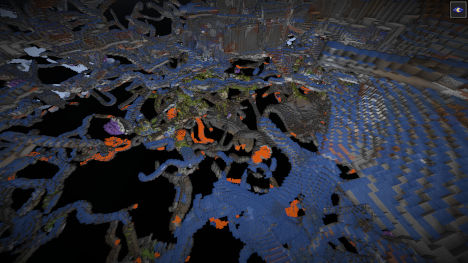
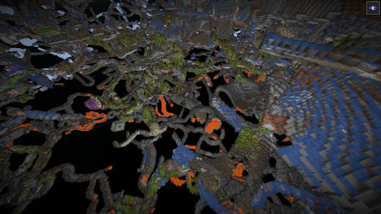
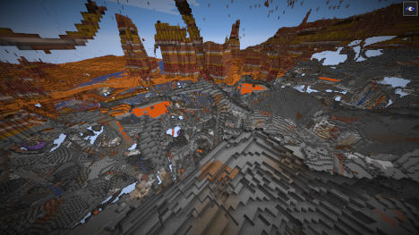
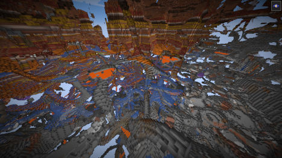
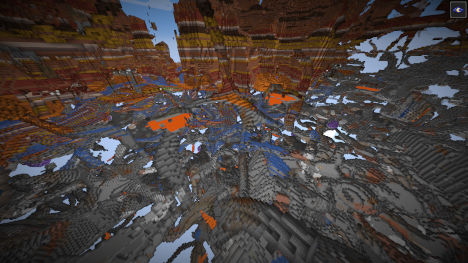

# Amplified world generation without excessive flooded caves

This datapack changes Minecraft's noise parameters to remove flooded caves in amplified world generation.
It achieves this by increasing the terrain density (= more stone/dirt) around y=46,
which cuts off most surface water from the cave systems.
It shouldn't make it harder to find caves since some seemingly ignore the inital density generation.

## Installation

Download the [.zip](https://github.com/FliegendeWurst/amplified_fixed/releases/download/v1/amplified_fixed.zip) and save it in your datapacks directory.

## Screenshots

| Vanilla affected by [MC-241283](https://bugs.mojang.com/browse/MC-241283) | With this datapack |
| ------------------------- | --------------------- |
|  |  |

Or a three-way comparison:
| Normal | Amplified | Amplified (fixed) |
| ------ | --------- | ----------------- |
|  |  |  |

As you can see, some flooding near the surface remains. I believe that can be corrected by tweaking the y level of my fix, but that will also lead to more terrain changes.

## Technical details

```jsonp
"initial_density_without_jaggedness": {
    "type": "minecraft:add",
    "argument1": {
        "type": "minecraft:mul",
        "argument1": 10.0,
        "argument2": {
            "type": "minecraft:min",
            "argument1": {
                "type": "minecraft:y_clamped_gradient",
                "from_value": 1.0,
                "from_y": 46,
                "to_value": 0.0,
                "to_y": 50
            },
            "argument2": {
                "type": "minecraft:y_clamped_gradient",
                "from_value": 0.0,
                "from_y": 42,
                "to_value": 1.0,
                "to_y": 46
            }
        }
    },
    "argument2": {
        vanilla noise expression
    }
}
```

## Removing all flooded caves

It is also possible to remove normal flooded caves by decreasing the `fluid_level_floodedness` noise.

## License

 <p xmlns:cc="http://creativecommons.org/ns#" xmlns:dct="http://purl.org/dc/terms/"><a property="dct:title" rel="cc:attributionURL" href="https://github.com/FliegendeWurst/amplified_fixed">amplified_fixed</a> by <span property="cc:attributionName">FliegendeWurst</span> is licensed under <a href="http://creativecommons.org/licenses/by/4.0/?ref=chooser-v1" target="_blank" rel="license noopener noreferrer" style="display:inline-block;">CC BY 4.0</a></p>

 `data/minecraft/worldgen/noise_settings/amplified.json` was derived from Minecraft 1.20.2, the license only applies to the changes outlined above.
